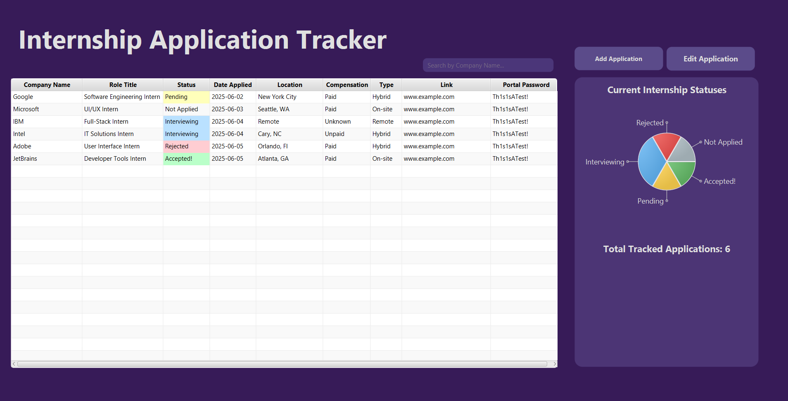
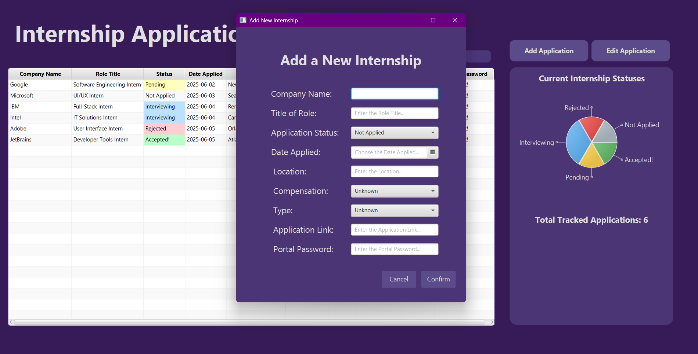
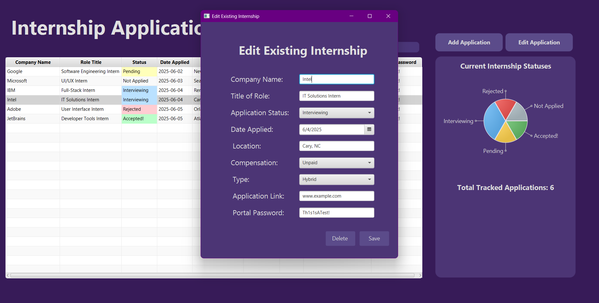

# 🎓 Internship Application Tracker

A Java-based desktop application designed to help keep track of internship applications.

## 📌 Notes

- This project is still under development. The core features are functional and tested for basic use.
- Designed and built for personal use, but open to anyone in need of an internship tracking tool.

## 🛠 Technologies Used

- **Java** (with OOP structure)
- **JavaFX** for GUI functionality
- **SceneBuilder** for visual FXML layout design
- **CSS** for styling the user interface
- **IntelliJ IDEA** as the development environment
- **CSV file writing/reading** for saving data locally 

## ✅ Completed Features

- Displays a **table** of all internship applications and their corresponding details
- **Add Application** button opens a popup window to input new internship details
- **Edit Application** button opens a popup window to edit or delete an existing application
- **Error handling** using JavaFx `Alert` popups
- An `Internship` class to store internship data as objects
- An `InternshipDataHandler` utility that saves and loads internship data from a local CSV file
- **Search** functionality by company name
- Color-coding of application statuses in the table:
  - Green = Accepted!  
  - Red = Rejected  
  - Yellow = Pending
  - Blue = Interviewing
  - Gray = Not Applied
- **Pie chart** showing the distribution of application statuses
- Counter to display total number of **tracked internships**

## 🚧 In Progress and Future Features

- Notes section or **calendar view** to track progress or important dates
- "Close" or "Log Out" button for user exit
- Creation of a **desktop icon** to launch the program like a traditional app
- Checkboxes to filter table by any internship details
- **Icons** to enhance UI experience 

## 📁 Running the Program

1. Clone or download this repository.
2. Open the project in **IntelliJ IDEA**.
3. Ensure JavaFX and SceneBuilder are configured properly.
4. Run `InternshipTracker.java` to launch the program.

- **Note:** The creation of a CSV file will automatically take place upon running the program for the first time. 

## 📷 Screenshots (Current Project)

### Main Dashboard

### Add Internship Popup Window

### Edit Internship Popup Window

### One Example of Error Handling and Alerts

---
